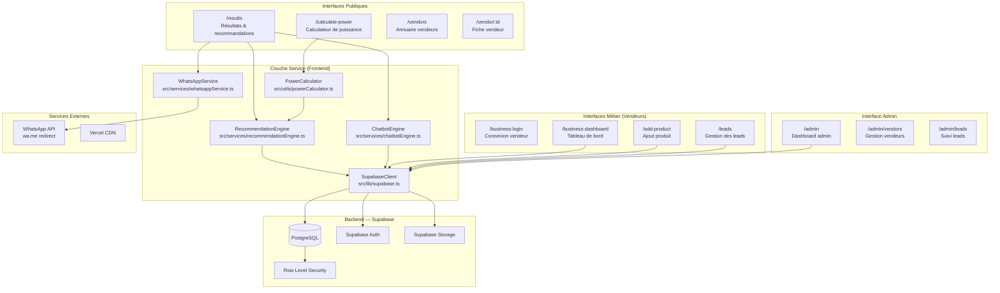
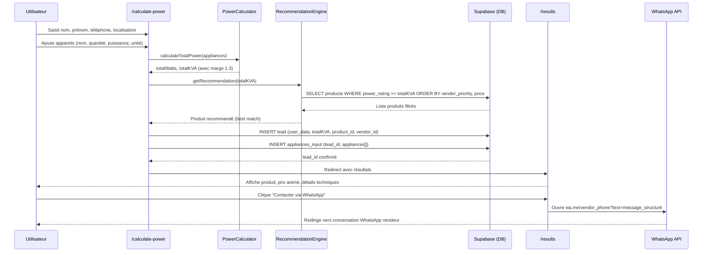
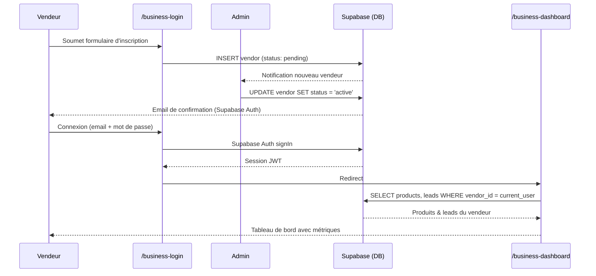
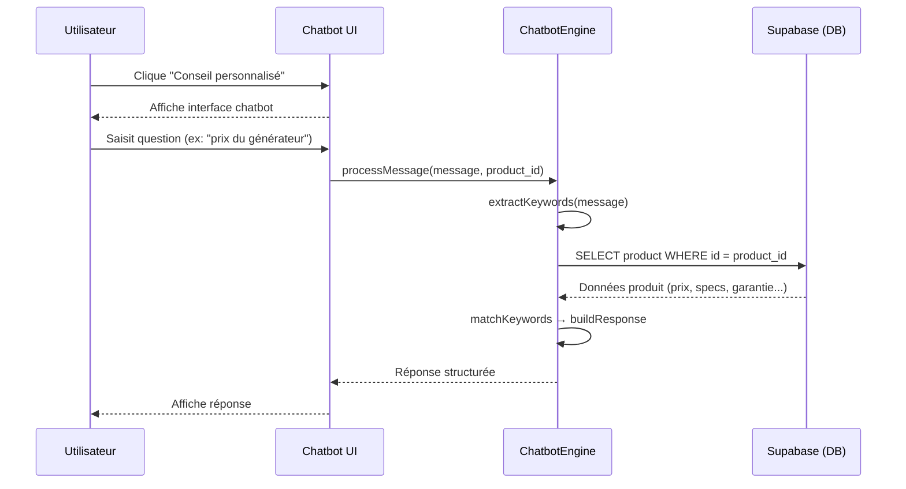
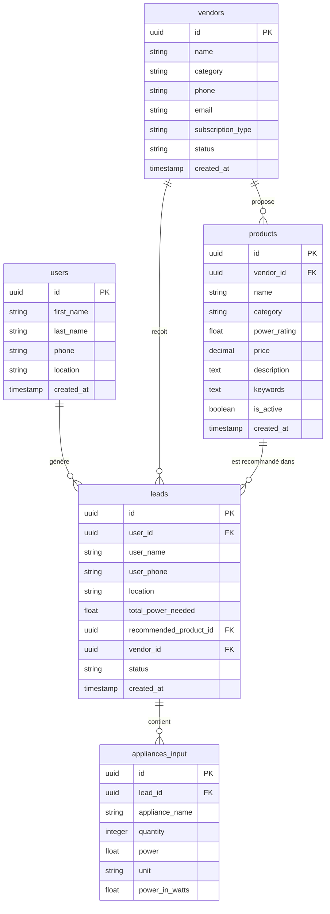

# Design Document: Krantos Platform

## Overview

Krantos est une marketplace intelligente dédiée à l'énergie et aux appareils électriques au Togo et en Afrique de l'Ouest. La plateforme permet aux particuliers et aux entreprises de calculer leurs besoins électriques, d'obtenir des recommandations de produits adaptées (groupes électrogènes, solutions solaires, etc.), et d'être mis en relation directement avec des vendeurs locaux vérifiés via WhatsApp.

Le modèle économique repose sur deux axes : un calculateur gratuit côté utilisateur (B2C) et un système d'abonnement, de leads payants et de commissions côté vendeurs (B2B). Chaque calcul effectué génère automatiquement un lead qualifié, liant l'utilisateur à un produit recommandé et à un vendeur, créant ainsi un pipeline de conversion mesurable.

La plateforme est construite sur React 18 / TypeScript (frontend) et Supabase (backend-as-a-service), avec un déploiement sur Vercel. L'interface est entièrement en français, mobile-first, et conçue pour minimiser les frictions dans les marchés à connectivité variable.

---

## Architecture Globale



---

## Flux Principaux (Diagrammes de Séquence)

### A. Flux Utilisateur — Calcul de Puissance & Lead



### B. Flux Vendeur — Inscription & Gestion



### C. Flux Chatbot — Conseil Personnalisé



---

## Composants et Interfaces

### 1. PowerCalculator (`src/utils/powerCalculator.ts`)

**Rôle** : Moteur de calcul de puissance électrique. Normalise toutes les entrées en Watts, applique la marge de sécurité, et convertit en kVA.

**Responsabilités** :
- Conversion d'unités : Watts (W), Ampères (A × Volts), Volts (V)
- Calcul de la puissance totale par appareil (puissance × quantité)
- Application de la marge de sécurité (facteur 1.3)
- Conversion Watts → kVA (÷ 1000)

**Interface** :

| Entrée | Type | Description |
|--------|------|-------------|
| appliances | ApplianceInput[] | Liste des appareils avec quantité, puissance, unité |

| Sortie | Type | Description |
|--------|------|-------------|
| totalWatts | number | Puissance totale en Watts (avec marge) |
| totalKVA | number | Puissance totale en kVA (avec marge) |
| breakdown | ApplianceBreakdown[] | Détail par appareil |

---

### 2. RecommendationEngine (`src/services/recommendationEngine.ts`)

**Rôle** : Sélectionne le produit le plus adapté aux besoins calculés parmi le catalogue vendeurs.

**Responsabilités** :
- Filtrer les produits dont `power_rating >= totalKVA`
- Trier par priorité vendeur (abonnement premium en premier), puis par prix croissant
- Retourner le meilleur match unique
- Gérer le cas "aucun produit disponible"

**Interface** :

| Entrée | Type | Description |
|--------|------|-------------|
| totalKVA | number | Besoin calculé en kVA |

| Sortie | Type | Description |
|--------|------|-------------|
| product | Product \| null | Produit recommandé |
| vendor | Vendor \| null | Vendeur associé |
| alternatives | Product[] | Produits alternatifs (optionnel) |

---

### 3. WhatsAppService (`src/services/whatsappService.ts`)

**Rôle** : Génère et déclenche la redirection WhatsApp avec un message pré-rempli structuré.

**Responsabilités** :
- Construire le message WhatsApp avec : nom/prénom utilisateur, téléphone, localisation, liste appareils, puissance totale (W et kVA), produit recommandé, prix
- Encoder le message pour l'URL (`encodeURIComponent`)
- Ouvrir `wa.me/{vendor_phone}?text={message}` dans un nouvel onglet
- Mettre à jour le statut du lead en `contacted`

**Format du message généré** :
```
Bonjour, je suis [Prénom Nom] (📞 [téléphone], 📍 [localisation]).
J'ai calculé mes besoins : [totalWatts] W / [totalKVA] kVA.
Appareils : [liste appareils].
Produit recommandé : [nom produit] — [prix] FCFA.
Je souhaite obtenir plus d'informations.
```

---

### 4. ChatbotEngine (`src/services/chatbotEngine.ts`)

**Rôle** : Moteur de réponse automatique basé sur des mots-clés, alimenté par les données produit du CRM.

**Responsabilités** :
- Extraire les mots-clés du message utilisateur
- Mapper les mots-clés aux champs produit correspondants
- Construire une réponse en langage naturel (français)
- Gérer les questions sans correspondance (réponse générique)

**Mots-clés supportés** :

| Mot-clé | Champ produit | Réponse type |
|---------|---------------|--------------|
| prix, coût, tarif | price | "Le prix de ce produit est [prix] FCFA." |
| caractéristiques, specs, puissance | power_rating, description | "Ce produit a une puissance de [kVA] kVA." |
| durée de vie, longévité | description (keywords) | Extrait depuis description |
| fiabilité, qualité | description (keywords) | Extrait depuis description |
| garantie | description (keywords) | Extrait depuis description |

---

### 5. SupabaseClient (`src/lib/supabase.ts`)

**Rôle** : Client centralisé pour toutes les interactions avec Supabase (DB, Auth, Storage).

**Responsabilités** :
- Initialisation du client Supabase avec les variables d'environnement
- Exposition des méthodes CRUD pour chaque entité (users, vendors, products, leads, appliances_input)
- Gestion des sessions d'authentification (vendeurs, admin)
- Upload/récupération des assets produits (images) via Supabase Storage

---

## Modèles de Données

### Schéma Entité-Relation



### Détail des Modèles

#### `users`
| Champ | Type | Contraintes | Description |
|-------|------|-------------|-------------|
| id | uuid | PK, auto | Identifiant unique |
| first_name | varchar(100) | NOT NULL | Prénom |
| last_name | varchar(100) | NOT NULL | Nom de famille |
| phone | varchar(20) | NOT NULL | Numéro de téléphone |
| location | varchar(200) | NOT NULL | Ville / quartier |
| created_at | timestamp | DEFAULT now() | Date de création |

#### `vendors`
| Champ | Type | Contraintes | Description |
|-------|------|-------------|-------------|
| id | uuid | PK, auto | Identifiant unique |
| name | varchar(200) | NOT NULL | Nom de l'entreprise |
| category | varchar(100) | NOT NULL | Catégorie (énergie, électroménager…) |
| phone | varchar(20) | NOT NULL | Téléphone WhatsApp |
| email | varchar(200) | UNIQUE | Email de connexion |
| subscription_type | enum | NOT NULL | free \| basic \| premium |
| status | enum | DEFAULT 'pending' | pending \| active \| suspended |
| created_at | timestamp | DEFAULT now() | Date d'inscription |

#### `products`
| Champ | Type | Contraintes | Description |
|-------|------|-------------|-------------|
| id | uuid | PK, auto | Identifiant unique |
| vendor_id | uuid | FK → vendors | Vendeur propriétaire |
| name | varchar(200) | NOT NULL | Nom du produit |
| category | varchar(100) | NOT NULL | Catégorie produit |
| power_rating | float | NOT NULL | Puissance en kVA |
| price | decimal(12,2) | NOT NULL | Prix en FCFA |
| description | text | | Description complète |
| keywords | text | | Mots-clés pour le chatbot |
| is_active | boolean | DEFAULT true | Produit visible ou non |
| created_at | timestamp | DEFAULT now() | Date d'ajout |

#### `leads`
| Champ | Type | Contraintes | Description |
|-------|------|-------------|-------------|
| id | uuid | PK, auto | Identifiant unique |
| user_id | uuid | FK → users | Utilisateur ayant calculé |
| user_name | varchar(200) | NOT NULL | Nom complet (dénormalisé) |
| user_phone | varchar(20) | NOT NULL | Téléphone (dénormalisé) |
| location | varchar(200) | NOT NULL | Localisation |
| total_power_needed | float | NOT NULL | Besoin en kVA |
| recommended_product_id | uuid | FK → products | Produit recommandé |
| vendor_id | uuid | FK → vendors | Vendeur ciblé |
| status | enum | DEFAULT 'new' | new \| contacted \| converted \| lost |
| created_at | timestamp | DEFAULT now() | Date du calcul |

#### `appliances_input`
| Champ | Type | Contraintes | Description |
|-------|------|-------------|-------------|
| id | uuid | PK, auto | Identifiant unique |
| lead_id | uuid | FK → leads | Lead associé |
| appliance_name | varchar(200) | NOT NULL | Nom de l'appareil |
| quantity | integer | NOT NULL, >= 1 | Quantité |
| power | float | NOT NULL | Valeur saisie |
| unit | enum | NOT NULL | W \| A \| V |
| power_in_watts | float | NOT NULL | Valeur normalisée en Watts |

---

## Gestion des Erreurs

### Scénario 1 : Aucun produit disponible pour le besoin calculé

**Condition** : `RecommendationEngine` ne trouve aucun produit avec `power_rating >= totalKVA`

**Réponse** : Afficher un message d'information sur la page `/results` indiquant qu'aucun produit ne correspond exactement, avec une suggestion de contacter un vendeur directement via l'annuaire `/vendors`

**Récupération** : Le lead est quand même enregistré avec `recommended_product_id = null` pour permettre un suivi admin

---

### Scénario 2 : Échec de l'enregistrement du lead (erreur Supabase)

**Condition** : Erreur réseau ou contrainte DB lors du `INSERT` dans `leads`

**Réponse** : `toast.error()` avec message explicite en français. Les résultats du calcul restent affichés (état local React)

**Récupération** : Bouton de retry visible. Le calcul n'est pas perdu (état React conservé)

---

### Scénario 3 : Vendeur non encore validé par l'admin

**Condition** : Vendeur tente de se connecter avec `status = 'pending'`

**Réponse** : Message d'attente clair sur `/business-login` : "Votre compte est en cours de validation par notre équipe."

**Récupération** : Aucune action requise de la part du vendeur

---

### Scénario 4 : Message WhatsApp non envoyé (téléphone vendeur manquant)

**Condition** : `vendor.phone` est null ou vide

**Réponse** : `toast.error()` + masquage du bouton WhatsApp. Affichage de l'email vendeur comme alternative

**Récupération** : Admin notifié pour compléter le profil vendeur

---

## Stratégie de Tests

### Tests Unitaires

- **PowerCalculator** : Vérifier les conversions d'unités (W, A×V, V), l'application de la marge 1.3, la conversion kVA
- **RecommendationEngine** : Vérifier le filtrage par `power_rating`, le tri par priorité vendeur puis prix, le cas "aucun résultat"
- **ChatbotEngine** : Vérifier la détection de mots-clés, la construction des réponses, le fallback générique
- **WhatsAppService** : Vérifier la construction du message, l'encodage URL, le format du lien `wa.me`

### Tests Basés sur les Propriétés (Property-Based Testing)

**Bibliothèque** : fast-check (TypeScript)

**Propriétés à tester** :
- Pour tout ensemble d'appareils valides, `totalKVA >= totalWatts / 1000` (marge de sécurité toujours appliquée)
- Pour tout `totalKVA`, le produit recommandé a toujours `power_rating >= totalKVA` (jamais de sous-dimensionnement)
- Pour tout message utilisateur contenant un mot-clé connu, le chatbot retourne une réponse non vide
- Pour tout lead créé, `appliances_input` contient au moins un enregistrement

### Tests d'Intégration

- Flux complet : saisie appareils → calcul → recommandation → enregistrement lead → redirection WhatsApp
- Flux vendeur : inscription → validation admin → connexion → ajout produit → visualisation lead
- Sécurité RLS Supabase : un vendeur ne peut voir que ses propres leads et produits

---

## Considérations de Performance

- **Chargement initial** : Code splitting par route (React lazy + Suspense) pour minimiser le bundle initial sur connexions lentes
- **Requêtes DB** : Index sur `products.power_rating`, `leads.vendor_id`, `leads.status` pour les requêtes fréquentes
- **Recommandation** : La requête de recommandation est limitée à 10 résultats maximum (LIMIT 10) pour éviter les surcharges
- **Images produits** : Stockées sur Supabase Storage avec CDN intégré, format WebP recommandé
- **Animations** : Framer Motion utilisé uniquement pour les éléments critiques (prix animé, transitions de page) — pas d'animations sur les listes longues

---

## Considérations de Sécurité

- **Row Level Security (RLS)** : Activé sur toutes les tables Supabase. Les vendeurs ne peuvent lire/modifier que leurs propres données (`vendor_id = auth.uid()`)
- **Authentification** : Supabase Auth avec JWT pour les vendeurs et l'admin. Les utilisateurs finaux (calculateur) ne nécessitent pas de compte
- **Variables d'environnement** : `VITE_SUPABASE_URL` et `VITE_SUPABASE_ANON_KEY` uniquement côté client. La clé service (admin) n'est jamais exposée côté frontend
- **Validation des entrées** : Toutes les saisies utilisateur (appareils, formulaires) sont validées côté client avant envoi à Supabase
- **Données personnelles** : Numéros de téléphone et noms stockés uniquement pour la génération de leads — conformité RGPD/loi togolaise à documenter
- **WhatsApp** : Redirection uniquement vers des numéros de vendeurs vérifiés et validés par l'admin

---

## Dépendances

| Dépendance | Version | Usage |
|------------|---------|-------|
| React | 18.x | Framework UI |
| TypeScript | 5.x | Typage statique |
| Vite | 5.x | Build tool |
| Tailwind CSS | 3.x | Styles utilitaires |
| Supabase JS | 2.x | Client BaaS (DB, Auth, Storage) |
| Framer Motion | 11.x | Animations UI |
| Sonner | 1.x | Notifications toast |
| Lucide React | 0.x | Icônes |
| jsPDF | 2.x | Export PDF des résultats |
| Vercel | — | Hébergement & déploiement |


---

## Propriétés de Correction

*Une propriété est une caractéristique ou un comportement qui doit être vrai pour toutes les exécutions valides d'un système — essentiellement, un énoncé formel sur ce que le système doit faire. Les propriétés servent de pont entre les spécifications lisibles par l'humain et les garanties de correction vérifiables automatiquement.*

---

### Propriété 1 : Normalisation des unités d'appareils

*Pour tout* appareil électrique valide avec une unité parmi W, A ou V, le PowerCalculator doit produire une valeur `power_in_watts` strictement positive et cohérente avec l'unité : égale à la valeur saisie pour W, égale à valeur × 220 pour A, et égale à la valeur saisie pour V.

**Valide : Exigences 3.1, 3.2**

---

### Propriété 2 : Invariant de marge de sécurité et conversion kVA

*Pour tout* ensemble non vide d'appareils électriques valides, la valeur `totalWatts` retournée par le PowerCalculator doit être égale à la somme de (puissance_normalisée × quantité) pour chaque appareil multipliée par 1.3, et `totalKVA` doit être égal à `totalWatts / 1000`.

**Valide : Exigences 3.3, 3.4, 3.5**

---

### Propriété 3 : Filtrage des produits par capacité

*Pour tout* `totalKVA` calculé et tout catalogue de produits, chaque produit retourné par le RecommendationEngine doit avoir un `power_rating >= totalKVA`. Aucun produit sous-dimensionné ne doit jamais être recommandé.

**Valide : Exigences 4.1**

---

### Propriété 4 : Ordre de priorité des recommandations

*Pour tout* ensemble de produits filtrés par le RecommendationEngine, les produits de vendeurs avec abonnement `premium` doivent apparaître avant les produits de vendeurs `basic` ou `free`, et à priorité égale, les produits doivent être triés par prix croissant. Le produit recommandé est toujours le premier élément de cette liste triée.

**Valide : Exigences 4.2, 4.3**

---

### Propriété 5 : Borne maximale des résultats de recommandation

*Pour tout* `totalKVA` et tout catalogue de produits, le RecommendationEngine ne doit jamais retourner plus de 10 produits dans sa liste de résultats.

**Valide : Exigences 4.5**

---

### Propriété 6 : Cardinalité des appareils dans un lead

*Pour tout* lead créé avec N appareils (N >= 1), la table `appliances_input` doit contenir exactement N enregistrements liés à ce `lead_id`, chacun avec les champs `appliance_name`, `quantity`, `power`, `unit` et `power_in_watts` renseignés.

**Valide : Exigences 5.2**

---

### Propriété 7 : Contenu du message WhatsApp

*Pour tout* utilisateur et tout produit recommandé, le message généré par le WhatsAppService doit contenir : le prénom et nom de l'utilisateur, son numéro de téléphone, sa localisation, la liste de ses appareils, la puissance totale en W et en kVA, le nom du produit recommandé et son prix en FCFA.

**Valide : Exigences 7.1**

---

### Propriété 8 : Format de l'URL WhatsApp

*Pour tout* message généré par le WhatsAppService, l'URL produite doit être de la forme `wa.me/{vendor_phone}?text={message_encodé}` où `{message_encodé}` est le résultat de `encodeURIComponent` appliqué au message structuré, et `{vendor_phone}` est le numéro de téléphone du vendeur associé.

**Valide : Exigences 7.2**

---

### Propriété 9 : Réponse du chatbot aux mots-clés connus

*Pour tout* message utilisateur contenant au moins un mot-clé reconnu (prix, coût, tarif, caractéristiques, specs, puissance, durée de vie, longévité, fiabilité, qualité, garantie), le ChatbotEngine doit retourner une réponse non vide contenant les informations du champ produit correspondant au mot-clé détecté.

**Valide : Exigences 8.2, 8.3**

---

### Propriété 10 : Réponse générique pour les mots-clés inconnus

*Pour tout* message utilisateur ne contenant aucun mot-clé reconnu par le ChatbotEngine, la réponse retournée doit être la réponse générique de fallback (non vide) invitant l'utilisateur à reformuler ou à contacter le vendeur.

**Valide : Exigences 8.4**

---

### Propriété 11 : Filtrage des vendeurs actifs dans l'annuaire public

*Pour tout* ensemble de vendeurs en base de données, la page `/vendors` ne doit afficher que les vendeurs dont le statut est `active`. Les vendeurs avec le statut `pending` ou `suspended` ne doivent jamais apparaître dans l'annuaire public.

**Valide : Exigences 9.1, 9.3**

---

### Propriété 12 : Isolation des données vendeur (sécurité RLS)

*Pour tout* vendeur authentifié, les opérations de lecture et d'écriture sur les tables `products` et `leads` ne doivent retourner ou modifier que les enregistrements dont le `vendor_id` correspond à l'identifiant de l'utilisateur authentifié (`auth.uid()`). Aucun vendeur ne doit pouvoir accéder aux données d'un autre vendeur.

**Valide : Exigences 11.1, 14.2**

---

### Propriété 13 : Exactitude des métriques du tableau de bord vendeur

*Pour tout* vendeur authentifié avec un ensemble de leads, les métriques affichées sur le tableau de bord (nombre de leads `new`, `contacted`, `converted`, `lost`) doivent correspondre exactement aux comptages réels des leads associés à ce `vendor_id` dans la base de données.

**Valide : Exigences 11.2**

---

### Propriété 14 : Exclusion des produits inactifs et des vendeurs suspendus

*Pour tout* produit avec `is_active = false` ou appartenant à un vendeur avec le statut `suspended`, le RecommendationEngine ne doit jamais inclure ce produit dans ses résultats de recommandation, et ce produit ne doit pas apparaître dans l'annuaire public.

**Valide : Exigences 12.3, 13.3**

---

### Propriété 15 : Validation des champs obligatoires du formulaire produit

*Pour toute* combinaison de champs obligatoires manquants (`name`, `category`, `power_rating`, `price`) dans le formulaire d'ajout de produit, le Système doit rejeter la soumission et afficher un message d'erreur pour chaque champ manquant, sans insérer d'enregistrement en base de données.

**Valide : Exigences 12.4**

---

### Propriété 16 : Validation des saisies utilisateur avant envoi à Supabase

*Pour toute* saisie utilisateur invalide (champs vides, valeurs hors limites, formats incorrects), le Système doit rejeter la saisie côté client avant tout envoi à Supabase, garantissant qu'aucune donnée invalide n'atteint la base de données.

**Valide : Exigences 14.4**

---

### Propriété 17 : Restriction des redirections WhatsApp aux vendeurs validés

*Pour toute* tentative de redirection WhatsApp, le WhatsAppService ne doit générer un lien `wa.me` que vers des numéros de téléphone appartenant à des vendeurs avec le statut `active` validés par l'administrateur. Aucune redirection vers un vendeur `pending` ou `suspended` ne doit être possible.

**Valide : Exigences 14.5**
