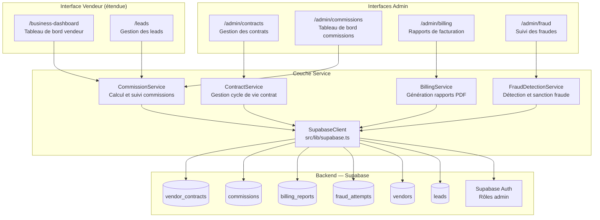

# Design Document : Gestion des Commissions, Contrats et Facturation Vendeurs

## Vue d’ensemble

Cette fonctionnalité étend la plateforme Krantos avec un système complet de gestion des commissions, des contrats vendeurs et de la facturation. Elle permet à l’équipe administrative de définir des taux de commission par vendeur, de gérer le cycle de vie des contrats (activation, expiration, renouvellement), de détecter les tentatives de fraude, et de générer des rapports de facturation périodiques.

Le système s’appuie sur les tables existantes (`vendors`, `products`, `leads`) et y ajoute de nouvelles entités : `vendor_contracts`, `commissions`, `billing_reports` et `fraud_attempts`. L’accès est contrôlé par deux niveaux de rôles administratifs : Super Administrateur et Administrateur collaborateur.

---

## Architecture Globale

---
