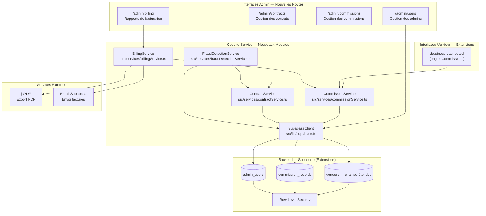
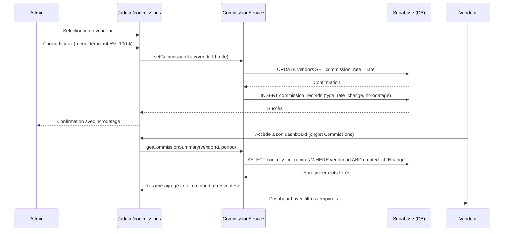
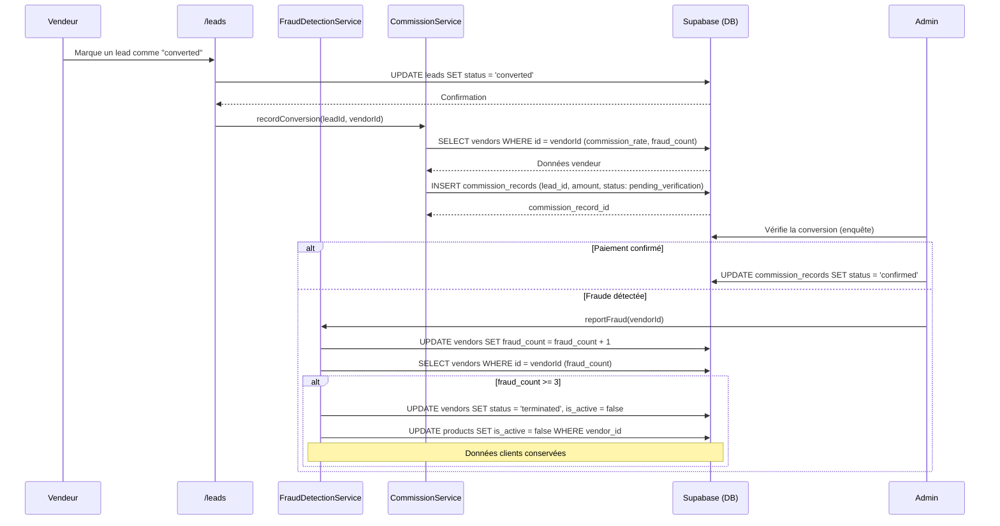
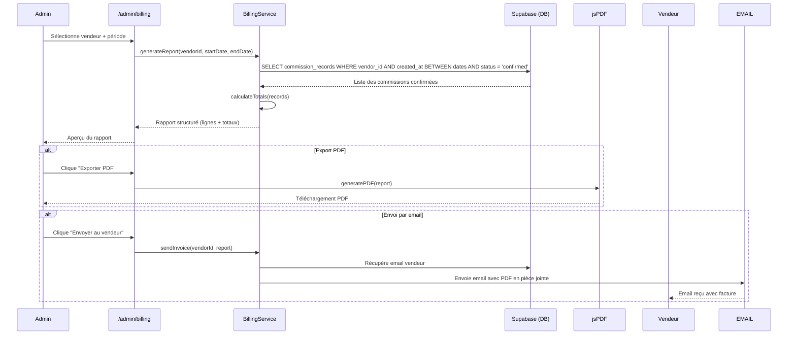
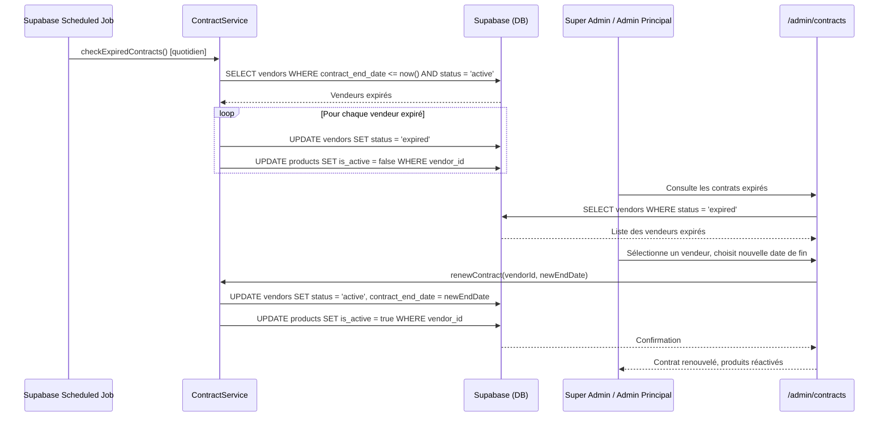
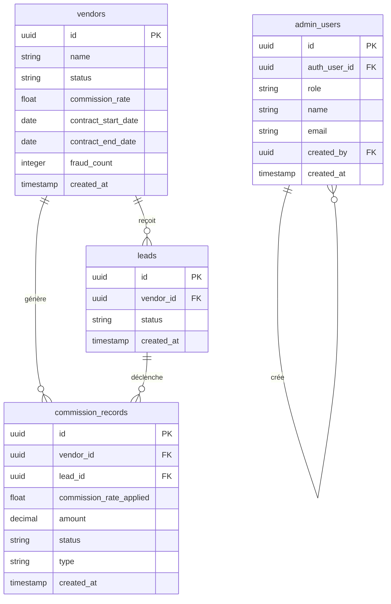

# Document de Design : Gestion des Commissions, Contrats et Facturation

## Vue d'ensemble

Ce module étend la plateforme Krantos avec un système complet de gestion contractuelle et financière des vendeurs. Il couvre cinq sous-systèmes interdépendants : la définition et le suivi des commissions par vendeur, le déclenchement et la vérification des commissions sur ventes converties, la génération de rapports de facturation exportables, la gestion du cycle de vie des contrats (expiration et renouvellement), et un système de rôles administrateurs à trois niveaux.

Ce module s'intègre directement dans l'architecture existante React 18 / TypeScript / Supabase / Tailwind CSS de Krantos. Il étend la table `vendors` existante, ajoute deux nouvelles tables (`commission_records` et `admin_users`), et introduit de nouvelles routes admin protégées par rôle.

---

## Architecture Globale

---

## Flux Principaux (Diagrammes de Séquence)

### A. Flux de Définition et Suivi des Commissions

### B. Flux de Déclenchement de Commission (Lead Converti)

### C. Flux de Génération de Rapport de Facturation

### D. Flux d'Expiration et Renouvellement de Contrat

---

## Composants et Interfaces

### 1. CommissionService (`src/services/commissionService.ts`)

**Rôle** : Gère la définition des taux de commission, l'enregistrement des conversions et le calcul des résumés.

**Responsabilités** :
- Définir et mettre à jour le taux de commission d'un vendeur
- Enregistrer chaque conversion de lead avec le montant de commission calculé
- Agréger les commissions par période (journalier, hebdomadaire, mensuel, trimestriel, semestriel, annuel)
- Fournir les données de dashboard pour l'admin et le vendeur

**Interface** :

| Méthode | Paramètres | Retour | Description |
|---------|-----------|--------|-------------|
| `setCommissionRate` | `vendorId: string, rate: number` | `Promise<void>` | Définit le taux (5–100, multiple de 5) |
| `recordConversion` | `leadId: string, vendorId: string` | `Promise<CommissionRecord>` | Enregistre une conversion |
| `getCommissionSummary` | `vendorId: string, period: TimePeriod` | `Promise<CommissionSummary>` | Résumé agrégé par période |
| `getCommissionHistory` | `vendorId: string, filters: CommissionFilters` | `Promise<CommissionRecord[]>` | Historique paginé |

---

### 2. ContractService (`src/services/contractService.ts`)

**Rôle** : Gère le cycle de vie des contrats vendeurs (création, expiration, renouvellement).

**Responsabilités** :
- Vérifier quotidiennement les contrats expirés
- Mettre à jour le statut vendeur à `expired` et masquer les produits
- Renouveler un contrat (Super Admin / Admin Principal uniquement)
- Réactiver les produits lors du renouvellement

**Interface** :

| Méthode | Paramètres | Retour | Description |
|---------|-----------|--------|-------------|
| `checkExpiredContracts` | — | `Promise<string[]>` | IDs des vendeurs expirés traités |
| `renewContract` | `vendorId: string, newEndDate: Date` | `Promise<void>` | Renouvelle le contrat |
| `getExpiringContracts` | `daysAhead: number` | `Promise<VendorContract[]>` | Contrats expirant bientôt |
| `terminateContract` | `vendorId: string, reason: string` | `Promise<void>` | Résiliation (fraude) |

---

### 3. BillingService (`src/services/billingService.ts`)

**Rôle** : Génère les rapports de facturation et orchestre l'export PDF et l'envoi par email.

**Responsabilités** :
- Agréger les commissions confirmées sur une période donnée
- Structurer le rapport (en-tête, lignes de détail, totaux)
- Déléguer la génération PDF à jsPDF
- Déclencher l'envoi email via Supabase

**Interface** :

| Méthode | Paramètres | Retour | Description |
|---------|-----------|--------|-------------|
| `generateReport` | `vendorId: string, startDate: Date, endDate: Date` | `Promise<BillingReport>` | Génère le rapport |
| `exportToPDF` | `report: BillingReport` | `void` | Télécharge le PDF |
| `sendInvoice` | `vendorId: string, report: BillingReport` | `Promise<void>` | Envoie par email |

---

### 4. FraudDetectionService (`src/services/fraudDetectionService.ts`)

**Rôle** : Détecte et traite les tentatives de fraude sur les conversions de leads.

**Responsabilités** :
- Incrémenter le compteur de fraude d'un vendeur
- Déclencher la résiliation automatique au 3ème incident
- Désactiver les accès et masquer les produits sans supprimer les données clients

**Interface** :

| Méthode | Paramètres | Retour | Description |
|---------|-----------|--------|-------------|
| `reportFraud` | `vendorId: string, leadId: string` | `Promise<FraudResult>` | Signale une fraude |
| `getFraudCount` | `vendorId: string` | `Promise<number>` | Compteur actuel |
| `isTerminated` | `vendorId: string` | `Promise<boolean>` | Vérifie si résilié |

---

## Modèles de Données

### Schéma Entité-Relation (Extensions)

### Détail des Modèles

#### Extensions de la table `vendors` (champs ajoutés)

| Champ | Type | Contraintes | Description |
|-------|------|-------------|-------------|
| `commission_rate` | float | DEFAULT 0, CHECK (0 <= rate <= 100) | Taux de commission en % |
| `contract_start_date` | date | | Date de début du contrat |
| `contract_end_date` | date | | Date de fin du contrat |
| `fraud_count` | integer | DEFAULT 0, CHECK (>= 0) | Nombre de fraudes signalées |

Extension de l'enum `vendor_status_enum` : ajout de la valeur `expired` et `terminated`.

#### Nouvelle table `commission_records`

| Champ | Type | Contraintes | Description |
|-------|------|-------------|-------------|
| `id` | uuid | PK, auto | Identifiant unique |
| `vendor_id` | uuid | FK → vendors, NOT NULL | Vendeur concerné |
| `lead_id` | uuid | FK → leads, NULLABLE | Lead associé (null pour changements de taux) |
| `commission_rate_applied` | float | NOT NULL | Taux appliqué au moment de l'enregistrement |
| `amount` | decimal(12,2) | NULLABLE | Montant de commission (si applicable) |
| `status` | enum | NOT NULL | `pending_verification` \| `confirmed` \| `rejected` \| `rate_change` |
| `type` | enum | NOT NULL | `conversion` \| `rate_change` |
| `notes` | text | | Notes admin (raison de rejet, etc.) |
| `created_at` | timestamp | DEFAULT now() | Horodatage |

#### Nouvelle table `admin_users`

| Champ | Type | Contraintes | Description |
|-------|------|-------------|-------------|
| `id` | uuid | PK, auto | Identifiant unique |
| `auth_user_id` | uuid | FK → auth.users, UNIQUE | Lien avec Supabase Auth |
| `role` | enum | NOT NULL | `super_admin` \| `admin_principal` \| `admin_collaborateur` |
| `name` | varchar(200) | NOT NULL | Nom complet |
| `email` | varchar(200) | UNIQUE, NOT NULL | Email de connexion |
| `created_by` | uuid | FK → admin_users, NULLABLE | Admin créateur (null pour Super Admin initial) |
| `created_at` | timestamp | DEFAULT now() | Date de création |

---

## Matrice des Droits par Rôle Admin

| Action | Super Admin | Admin Principal | Admin Collaborateur |
|--------|-------------|-----------------|---------------------|
| Définir taux de commission | ✅ | ✅ | ✅ |
| Valider/rejeter une conversion | ✅ | ✅ | ✅ |
| Signaler une fraude | ✅ | ✅ | ✅ |
| Générer rapport de facturation | ✅ | ✅ | ✅ |
| Envoyer facture par email | ✅ | ✅ | ✅ |
| Renouveler un contrat | ✅ | ✅ | ❌ |
| Résilier un contrat | ✅ | ✅ | ❌ |
| Créer un Admin Collaborateur | ✅ | ✅ | ❌ |
| Créer un Admin Principal | ✅ | ❌ | ❌ |
| Créer un Super Admin | ✅ | ❌ | ❌ |

---

## Filtres Temporels du Dashboard

Les filtres s'appliquent aux requêtes Supabase via des plages sur `created_at` :

| Filtre | Calcul de la plage |
|--------|-------------------|
| Journalier | `today 00:00:00` → `today 23:59:59` |
| Hebdomadaire | `lundi de la semaine courante` → `aujourd'hui` |
| Mensuel | `1er du mois courant` → `aujourd'hui` |
| Trimestriel | `1er du trimestre courant` → `aujourd'hui` |
| Semestriel | `1er du semestre courant` → `aujourd'hui` |
| Annuel | `1er janvier de l'année courante` → `aujourd'hui` |

---

## Gestion des Erreurs

### Scénario 1 : Taux de commission invalide

**Condition** : L'admin tente de définir un taux qui n'est pas un multiple de 5 entre 5 et 100.

**Réponse** : Validation côté client (menu déroulant contraint) + contrainte CHECK en base. Message d'erreur en français.

**Récupération** : Le taux précédent reste inchangé.

---

### Scénario 2 : Résiliation pour fraude (3ème incident)

**Condition** : `fraud_count` atteint 3 lors d'un appel à `reportFraud`.

**Réponse** : Mise à jour atomique du statut vendeur à `terminated`, désactivation de tous ses produits, suppression de la session active. Les données clients (leads, `appliances_input`) sont conservées intactes.

**Récupération** : Irréversible — aucune interface de réactivation pour les vendeurs `terminated`.

---

### Scénario 3 : Expiration de contrat

**Condition** : `contract_end_date <= now()` détecté par le job quotidien.

**Réponse** : Statut vendeur → `expired`, tous les produits → `is_active = false`. Le vendeur ne peut plus se connecter (message explicite : "Votre contrat a expiré. Contactez l'administration pour le renouveler.").

**Récupération** : Renouvellement par Super Admin ou Admin Principal depuis `/admin/contracts`.

---

### Scénario 4 : Tentative de renouvellement par Admin Collaborateur

**Condition** : Un Admin Collaborateur tente d'accéder à l'action de renouvellement.

**Réponse** : Vérification du rôle côté client (bouton masqué) et côté serveur (RLS / politique Supabase). Message d'erreur : "Vous n'avez pas les droits pour effectuer cette action."

**Récupération** : L'Admin Collaborateur doit contacter un Super Admin ou Admin Principal.

---

## Stratégie de Tests

### Tests Unitaires

- **CommissionService** : Vérifier le calcul du montant de commission (`amount = lead_value × rate / 100`), la validation du taux (multiple de 5, bornes 5–100), l'agrégation par période
- **ContractService** : Vérifier la détection des contrats expirés, la logique de renouvellement, la désactivation des produits
- **BillingService** : Vérifier la structure du rapport généré, le calcul des totaux, le format PDF
- **FraudDetectionService** : Vérifier l'incrémentation du compteur, le déclenchement de la résiliation au 3ème incident

### Tests Basés sur les Propriétés (Property-Based Testing)

**Bibliothèque** : fast-check (TypeScript)

**Propriétés à tester** :
- Pour tout taux de commission valide (multiple de 5, entre 5 et 100), le montant calculé est toujours dans l'intervalle `[0, lead_value]`
- Pour tout ensemble de commissions confirmées sur une période, le total du rapport est égal à la somme des montants individuels
- Pour tout vendeur avec `fraud_count >= 3`, son statut est toujours `terminated` et aucun de ses produits n'est `is_active = true`
- Pour tout vendeur avec `contract_end_date < now()`, son statut est `expired` ou `terminated` (jamais `active`)

### Tests d'Intégration

- Flux complet : définition du taux → conversion lead → enregistrement commission → génération rapport → export PDF
- Flux fraude : 3 signalements → résiliation automatique → vérification produits masqués
- Flux contrat : expiration → masquage → renouvellement → réactivation produits

---

## Considérations de Sécurité

- **RLS sur `commission_records`** : Un vendeur ne peut lire que ses propres enregistrements. Les admins ont accès complet via le rôle service.
- **RLS sur `admin_users`** : Seul le Super Admin peut créer des enregistrements. Les admins collaborateurs ne peuvent pas lire les enregistrements des autres admins.
- **Vérification du rôle côté serveur** : Toutes les actions sensibles (renouvellement, résiliation, création d'admin) vérifient le rôle dans `admin_users` via une fonction Supabase RPC, pas uniquement côté client.
- **Atomicité des opérations de fraude** : La mise à jour du `fraud_count` et la résiliation éventuelle sont effectuées dans une transaction Supabase pour éviter les états incohérents.
- **Données clients conservées** : La résiliation ne supprime jamais les tables `leads`, `users` ou `appliances_input` — conformité avec les obligations légales de conservation des données.

---

## Considérations de Performance

- **Index sur `commission_records`** : Index sur `(vendor_id, created_at)` pour les requêtes de dashboard filtrées par période.
- **Index sur `vendors.contract_end_date`** : Pour le job quotidien de détection des expirations.
- **Index sur `vendors.status`** : Pour filtrer rapidement les vendeurs actifs/expirés dans les requêtes publiques.
- **Pagination** : L'historique des commissions est paginé (20 enregistrements par page) pour éviter les surcharges sur les vendeurs avec un grand volume.

---

## Dépendances

| Dépendance | Version | Usage |
|------------|---------|-------|
| jsPDF | 2.x | Export PDF des rapports de facturation (déjà installé) |
| fast-check | 3.x | Tests de propriété (déjà installé) |
| Supabase JS | 2.x | DB, Auth, RPC (déjà installé) |
| React 18 | 18.x | Composants UI (déjà installé) |
| Tailwind CSS | 3.x | Styles (déjà installé) |

Aucune nouvelle dépendance externe n'est requise.

---

## Propriétés de Correction

*Une propriété est une caractéristique ou un comportement qui doit être vrai pour toutes les exécutions valides du système — un énoncé formel sur ce que le système doit garantir, vérifiable automatiquement par property-based testing.*

---

### Propriété C1 : Validité du taux de commission

*Pour tout* taux de commission `r` accepté par le système, `r` est un entier multiple de 5, compris entre 5 et 100 inclus. Aucun taux en dehors de cet ensemble ne peut être enregistré en base de données.

**Valide : Exigences C1.1, C1.2**

---

### Propriété C2 : Calcul du montant de commission

*Pour tout* enregistrement de commission avec un montant de vente `v` et un taux `r`, le montant de commission `amount` satisfait : `amount = v × r / 100`, et `0 <= amount <= v`.

**Valide : Exigences C2.1, C2.2**

---

### Propriété C3 : Cohérence du total de facturation

*Pour tout* rapport de facturation généré sur une période donnée pour un vendeur, le total affiché est exactement égal à la somme des montants de toutes les commissions avec le statut `confirmed` dans cette période pour ce vendeur. Aucune commission `pending_verification` ou `rejected` n'est incluse dans le total.

**Valide : Exigences C3.1, C3.2**

---

### Propriété C4 : Règle de résiliation pour fraude

*Pour tout* vendeur dont le `fraud_count` atteint ou dépasse 3, son statut est `terminated` et tous ses produits ont `is_active = false`. Cette propriété est irréversible : aucun vendeur `terminated` ne peut repasser à un statut `active` ou `expired`.

**Valide : Exigences C4.1, C4.2, C4.3**

---

### Propriété C5 : Conservation des données clients après résiliation

*Pour tout* vendeur résilié (statut `terminated`), les enregistrements dans les tables `leads`, `users` et `appliances_input` associés à ce vendeur sont conservés intégralement. Aucune suppression en cascade ne doit affecter ces données.

**Valide : Exigences C4.4**

---

### Propriété C6 : Exclusion des vendeurs expirés de l'annuaire public

*Pour tout* vendeur avec le statut `expired` ou `terminated`, aucun de ses produits n'apparaît dans les recommandations du `RecommendationEngine` ni dans l'annuaire public `/vendors`. Cette propriété étend la Propriété 11 et la Propriété 14 du spec principal.

**Valide : Exigences C5.1, C5.2**

---

### Propriété C7 : Restriction du renouvellement de contrat

*Pour tout* utilisateur admin avec le rôle `admin_collaborateur`, toute tentative de renouvellement ou de résiliation de contrat est rejetée par le système, aussi bien côté client que côté serveur. Seuls les rôles `super_admin` et `admin_principal` peuvent effectuer ces opérations.

**Valide : Exigences C6.1, C6.2**

---

### Propriété C8 : Monotonie du compteur de fraude

*Pour tout* vendeur, le `fraud_count` est strictement croissant : il ne peut qu'augmenter ou rester stable, jamais diminuer. Une fois à 3, le statut `terminated` est définitif.

**Valide : Exigences C4.1**

---

### Propriété C9 : Cohérence du statut vendeur et de la visibilité des produits

*Pour tout* vendeur, si son statut est `active`, ses produits peuvent être `is_active = true`. Si son statut est `expired`, `suspended` ou `terminated`, tous ses produits sont `is_active = false`. Il n'existe aucun état où un produit est `is_active = true` pour un vendeur non `active`.

**Valide : Exigences C5.1, C5.2, C4.2**
